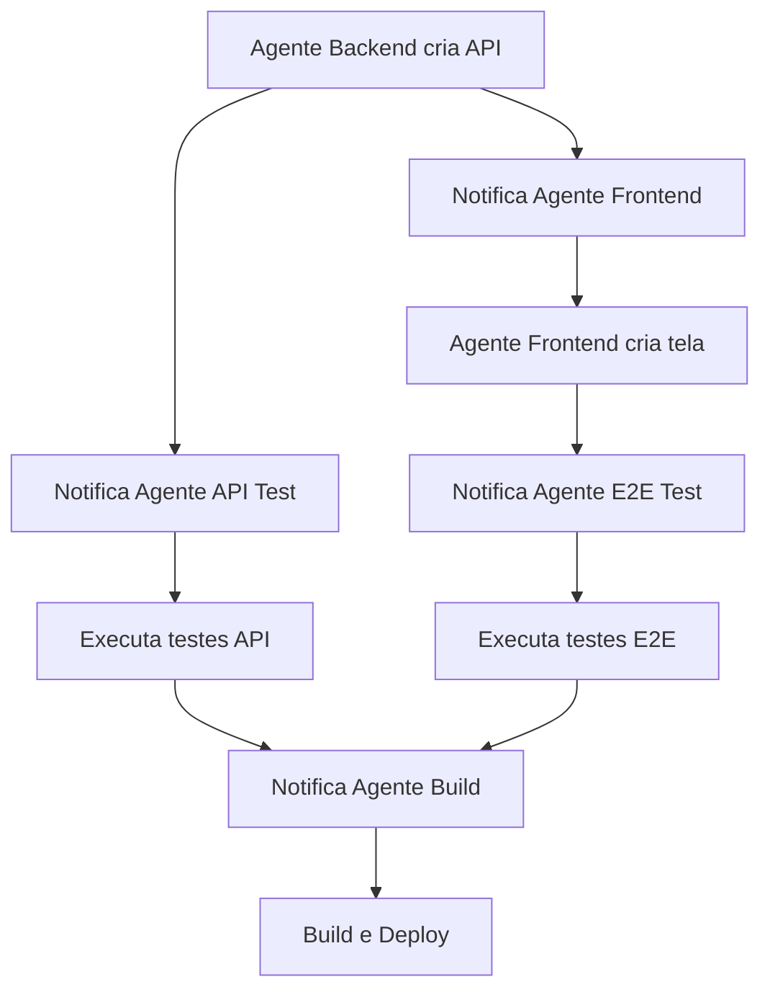

# 🤖 Sistema Colaborativo de 41 Agentes - GiroPro

## 🎯 Visão Geral

Este documento detalha a arquitetura e o funcionamento do sistema GiroPro, um ecossistema de automação distribuída composto por 41 agentes especializados. O objetivo é otimizar o desenvolvimento de software, garantindo paralelismo máximo, alta qualidade e um fluxo de trabalho contínuo e eficiente, operando 24 horas por dia, 7 dias por semana.

O sistema é projetado para ser auto-organizado e resiliente, com cada agente focado em sua especialidade, e um agente central, o **Agente 41 - Scrum Master**, orquestrando as operações para garantir a comunicação eficaz, a distribuição inteligente de tarefas e a prevenção de conflitos e redundâncias.

## 🏗️ Distribuição de Agentes por Especialização

O sistema é composto por 41 agentes, divididos em equipes com especializações distintas. A adição do Agente 41 - Scrum Master eleva a capacidade de orquestração e gerenciamento do fluxo de trabalho.

### 🔧 Equipe Backend (Agentes 1-10)
**Agentes de Desenvolvimento:**
- **Agente 01 - Backend Simple Tasks**: Tarefas simples de backend
- **Agente 02 - Backend Complex Tasks**: Tarefas complexas de backend
- **Agente 03 - API Simple Builder**: APIs simples e CRUD básico
- **Agente 04 - API Complex Builder**: APIs complexas e lógica de negócio
- **Agente 05 - Database Simple Ops**: Operações simples de banco
- **Agente 06 - Database Complex Ops**: Operações complexas e otimizações
- **Agente 07 - Auth Simple**: Autenticação básica
- **Agente 08 - Auth Complex**: Autorização avançada e segurança
- **Agente 09 - Middleware Simple**: Middlewares básicos
- **Agente 10 - Middleware Complex**: Middlewares avançados

### 🎨 Equipe Frontend (Agentes 11-20)
**Agentes de Desenvolvimento:**
- **Agente 11 - Frontend Simple Tasks**: Tarefas simples de frontend
- **Agente 12 - Frontend Complex Tasks**: Tarefas complexas de frontend
- **Agente 13 - Component Simple**: Componentes básicos React Native
- **Agente 14 - Component Complex**: Componentes avançados e customizados
- **Agente 15 - Screen Simple**: Telas simples e layouts básicos
- **Agente 16 - Screen Complex**: Telas complexas e interações avançadas
- **Agente 17 - Style Simple**: Estilos básicos e temas
- **Agente 18 - Style Complex**: Animações e estilos avançados
- **Agente 19 - Navigation Simple**: Navegação básica
- **Agente 20 - Navigation Complex**: Navegação avançada e deep linking

### 🧪 Equipe Testes (Agentes 21-32)
**Agentes de Testes Especializados:**
- **Agente 21 - Unit Test Simple**: Testes unitários simples
- **Agente 22 - Unit Test Complex**: Testes unitários complexos
- **Agente 23 - Integration Test Simple**: Testes de integração básicos
- **Agente 24 - Integration Test Complex**: Testes de integração avançados
- **Agente 25 - E2E Test Simple**: Testes E2E básicos
- **Agente 26 - E2E Test Complex**: Testes E2E complexos
- **Agente 27 - API Test Simple**: Testes de API básicos
- **Agente 28 - API Test Complex**: Testes de API avançados
- **Agente 29 - Performance Test**: Testes de performance
- **Agente 30 - Security Test**: Testes de segurança
- **Agente 31 - Load Test**: Testes de carga
- **Agente 32 - Regression Test**: Testes de regressão

### 🚀 Equipe DevOps (Agentes 33-40)
**Agentes de Infraestrutura:**
- **Agente 33 - Build Simple**: Builds básicos
- **Agente 34 - Build Complex**: Builds otimizados e complexos
- **Agente 35 - Deploy Simple**: Deploys básicos
- **Agente 36 - Deploy Complex**: Deploys avançados e rollbacks
- **Agente 37 - Monitor Simple**: Monitoramento básico
- **Agente 38 - Monitor Complex**: Monitoramento avançado e alertas
- **Agente 39 - Backup Simple**: Backups básicos
- **Agente 40 - Backup Complex**: Backups avançados e recuperação

### 🧙‍♂️ Agente Orquestrador (Agente 41)
- **Agente 41 - Scrum Master**: Orquestração, gerenciamento de backlog, delegação inteligente, prevenção de conflitos, monitoramento de performance e guardião do processo.

## 📊 Sistema de Classificação de Tarefas

### 🎯 Por Prioridade
```yaml
CRÍTICA (P0):
  - Bugs de produção
  - Falhas de segurança
  - Indisponibilidade do sistema
  - Tempo de execução: Imediato
  - Agentes responsáveis: Todos disponíveis

ALTA (P1):
  - Features principais
  - Testes críticos
  - Deploy de produção
  - Tempo de execução: < 2 horas
  - Agentes responsáveis: Especialistas

MÉDIA (P2):
  - Melhorias de performance
  - Refatoração
  - Documentação importante
  - Tempo de execução: < 8 horas
  - Agentes responsáveis: Equipe específica

BAIXA (P3):
  - Limpeza de código
  - Documentação geral
  - Otimizações menores
  - Tempo de execução: < 24 horas
  - Agentes responsáveis: Agentes simples
```

### 🔧 Por Complexidade
```yaml
SIMPLES:
  - CRUD básico
  - Componentes padrão
  - Testes unitários básicos
  - Configurações simples
  - Tempo estimado: 15-60 min
  - Agentes: Simple Tasks

COMPLEXA:
  - Lógica de negócio avançada
  - Componentes customizados
  - Testes de integração
  - Configurações avançadas
  - Tempo estimado: 1-4 horas
  - Agentes: Complex Tasks
```

## 🔄 Sistema de Comunicação Entre Agentes

### 📝 Formato de Mensagens
```json
{
  "id": "task_20250912_001",
  "from_agent": "agent_03_api_simple",
  "to_agent": "agent_21_unit_test_simple",
  "type": "task_request",
  "priority": "P1",
  "complexity": "simple",
  "title": "Criar testes para endpoint /users",
  "description": "Endpoint /users criado, necessita testes unitários",
  "dependencies": ["endpoint_users_created"],
  "estimated_time": "30min",
  "deadline": "2025-09-12T14:00:00Z",
  "context": {
    "endpoint": "/api/v1/users",
    "methods": ["GET", "POST"],
    "branch": "agent-03/api-users-20250912-1200"
  }
}
```

### 🔔 Tipos de Comunicação
```yaml
TASK_REQUEST:
  - Solicitação de nova tarefa
  - Enviado quando agente completa tarefa que gera dependência

TASK_COMPLETED:
  - Notificação de conclusão
  - Enviado quando tarefa é finalizada com sucesso

TASK_BLOCKED:
  - Notificação de bloqueio
  - Enviado quando tarefa não pode prosseguir

TASK_FAILED:
  - Notificação de falha
  - Enviado quando tarefa falha e precisa de intervenção

HELP_REQUEST:
  - Solicitação de ajuda
  - Enviado quando agente precisa de assistência

STATUS_UPDATE:
  - Atualização de progresso
  - Enviado periodicamente durante execução
```

## 🔗 Matriz de Dependências

### Backend → Frontend
```yaml
Agente 03 (API Simple) → Agente 15 (Screen Simple):
  - "API /users criada" → "Criar tela de usuários"
  - "API /auth criada" → "Criar tela de login"

Agente 04 (API Complex) → Agente 16 (Screen Complex):
  - "API /dashboard criada" → "Criar dashboard complexo"
  - "API /reports criada" → "Criar tela de relatórios"
```

### Backend → Testes
```yaml
Agente 03 (API Simple) → Agente 27 (API Test Simple):
  - "Endpoint criado" → "Criar testes de API"

Agente 04 (API Complex) → Agente 28 (API Test Complex):
  - "Lógica complexa implementada" → "Criar testes avançados"
```

### Frontend → Testes
```yaml
Agente 13 (Component Simple) → Agente 21 (Unit Test Simple):
  - "Componente criado" → "Criar testes unitários"

Agente 15 (Screen Simple) → Agente 25 (E2E Test Simple):
  - "Tela criada" → "Criar testes E2E"
```

### Testes → DevOps
```yaml
Agente 21-32 (Todos Testes) → Agente 33 (Build Simple):
  - "Todos testes passando" → "Executar build"

Agente 33 (Build Simple) → Agente 35 (Deploy Simple):
  - "Build bem-sucedido" → "Executar deploy"
```

## 📋 Micro-tarefas por Camada de Testes

### 🧪 Testes Unitários (Agentes 21-22)

#### Agente 21 - Unit Test Simple
**Tarefas Simples (P2-P3):**
- Testar funções puras
- Testar componentes básicos
- Testar utilitários
- Testar validações simples
- Testar formatadores

**Cronograma:**
```
A cada 30 minutos: Verificar novos componentes/funções
06:00, 06:30, 07:00... : Criar testes para novos códigos
```

#### Agente 22 - Unit Test Complex
**Tarefas Complexas (P1-P2):**
- Testar hooks customizados
- Testar lógica de negócio
- Testar integrações com Context
- Testar componentes com estado complexo
- Testar middlewares

**Cronograma:**
```
A cada 1 hora: Verificar código complexo
07:00, 08:00, 09:00... : Criar testes avançados
```

### 🔗 Testes de Integração (Agentes 23-24)

#### Agente 23 - Integration Test Simple
**Tarefas Simples (P2):**
- Testar integração entre componentes
- Testar fluxos básicos
- Testar comunicação API simples
- Testar navegação básica

#### Agente 24 - Integration Test Complex
**Tarefas Complexas (P1):**
- Testar fluxos completos de usuário
- Testar integração com banco de dados
- Testar autenticação/autorização
- Testar sincronização de estado

### 🌐 Testes E2E (Agentes 25-26)

#### Agente 25 - E2E Test Simple
**Tarefas Simples (P2):**
- Testar login/logout
- Testar navegação básica
- Testar formulários simples
- Testar CRUD básico

#### Agente 26 - E2E Test Complex
**Tarefas Complexas (P1):**
- Testar fluxos de negócio completos
- Testar cenários de erro
- Testar performance de fluxos
- Testar compatibilidade cross-platform

### 🔌 Testes de API (Agentes 27-28)

#### Agente 27 - API Test Simple
**Tarefas Simples (P2):**
- Testar endpoints CRUD
- Testar validação de entrada
- Testar códigos de status HTTP
- Testar headers básicos

#### Agente 28 - API Test Complex
**Tarefas Complexas (P1):**
- Testar autenticação JWT
- Testar rate limiting
- Testar transações complexas
- Testar concorrência

### ⚡ Testes Especializados (Agentes 29-32)

#### Agente 29 - Performance Test
**Tarefas de Performance (P1-P2):**
- Testar tempo de resposta de APIs
- Testar renderização de componentes
- Testar uso de memória
- Testar otimizações

#### Agente 30 - Security Test
**Tarefas de Segurança (P0-P1):**
- Testar vulnerabilidades OWASP
- Testar injeção SQL
- Testar XSS
- Testar autenticação

#### Agente 31 - Load Test
**Tarefas de Carga (P1):**
- Testar carga de usuários simultâneos
- Testar stress do banco de dados
- Testar limites de API
- Testar escalabilidade

#### Agente 32 - Regression Test
**Tarefas de Regressão (P1):**
- Executar suite completa de testes
- Comparar com baseline anterior
- Identificar regressões
- Gerar relatórios de qualidade

## 🔄 Fluxo de Trabalho Colaborativo

### 1. Ciclo de Desenvolvimento


### 2. Exemplo de Comunicação
```yaml
# Agente 03 completa criação de API
Agente 03 → Sistema:
  task_completed:
    id: "api_users_crud"
    branch: "agent-03/api-users-20250912"
    endpoints: ["/users GET", "/users POST", "/users/:id PUT", "/users/:id DELETE"]

# Sistema notifica dependentes
Sistema → Agente 15:
  task_request:
    title: "Criar tela de gerenciamento de usuários"
    dependency: "api_users_crud"
    priority: "P1"

Sistema → Agente 27:
  task_request:
    title: "Criar testes para API de usuários"
    dependency: "api_users_crud"
    priority: "P1"
```

### 3. Cronograma Inteligente: Estratégia de "Ondas" de Execução por Turnos

Para evitar conflitos de merge e otimizar o uso dos recursos, os agentes operam em um cronograma de turnos coordenados, orquestrado pelo Agente 41 - Scrum Master. Esta estratégia de "Ondas" (Wave-Based Scheduling) agrupa agentes por afinidade de tarefas e dependências, criando um fluxo de trabalho rítmico e contínuo, 24/7.

#### **Turno 1: Manhã (06:00 - 12:00) - Foco em Desenvolvimento de Novas Funcionalidades**

Este é o turno de "criação". O objetivo é construir a base das funcionalidades do dia.

*   **Onda de Backend (06:00 - 11:00):**
    *   `06:00`: Agente 01 (Setup) e Agente 05 (DB Guardian) validam o ambiente e o banco.
    *   `06:15`: Agente 09 (API Builder) e Agente 10 (Route Manager) começam a criar os endpoints.
    *   `06:30`: Agente 07 (Auth) e Agente 08 (Auth Complex) trabalham em tarefas de segurança.
    *   *...e assim por diante, com um intervalo de 15 minutos entre os agentes da mesma equipe.* 

*   **Onda de Frontend (Paralela, 07:00 - 12:00):** O Frontend começa um pouco depois, para já poder consumir algumas APIs ou trabalhar em componentes independentes.
    *   `07:00`: Agente 11 (Component Builder) começa a criar componentes genéricos.
    *   `07:15`: Agente 15 (Style Manager) trabalha em estilos globais.
    *   `08:00`: Agente 12 (Screen Creator) começa a montar telas, já com as primeiras APIs do backend prontas.

*   **Onda de Testes Unitários (Contínua, 06:30 - 12:00):**
    *   `06:30`: Agente 21 (Unit Test Simple) começa a testar o código da noite anterior.
    *   `07:30`: Agente 22 (Unit Test Complex) começa a testar lógicas de negócio mais complexas que foram finalizadas.

#### **Turno 2: Tarde (12:00 - 18:00) - Foco em Integração e Testes**

Este turno é sobre "conectar as peças" e garantir que tudo funcione em conjunto.

*   **Onda de Integração Frontend (12:00 - 17:00):**
    *   Agentes de Frontend (12 a 18) focam em conectar as telas com as APIs, gerenciar estado e finalizar a experiência do usuário.

*   **Onda de Testes de Integração e E2E (13:00 - 18:00):**
    *   `13:00`: Agente 23 (Integration Test Simple) começa a testar a comunicação API-UI.
    *   `14:00`: Agente 25 (E2E Test Simple) começa a criar testes de fluxo completo para as funcionalidades desenvolvidas pela manhã.
    *   `15:00`: Agente 27 (API Test Simple) garante que as APIs criadas estão robustas.

*   **Onda de Correção de Bugs (Contínua):**
    *   Agentes de Backend e Frontend ficam de "plantão" para corrigir bugs apontados pelos agentes de teste. O Scrum Master prioriza essas tarefas como P0 ou P1.

#### **Turno 3: Noite/Madrugada (18:00 - 06:00) - Foco em Build, Deploy e Manutenção Pesada**

Este é o turno "operacional". O objetivo é estabilizar, implantar e preparar o sistema para o próximo ciclo.

*   **Onda de Build e Deploy (18:00 - 22:00):**
    *   `18:00`: Agente 32 (Regression Test) executa a suíte completa de testes de regressão.
    *   `19:00`: Se a regressão passar, Agente 33 (Build Simple) gera o build da aplicação.
    *   `20:00`: Agente 35 (Staging Manager) faz o deploy para o ambiente de `staging`.
    *   `21:00`: Agente 26 (E2E Test Complex) executa uma última rodada de testes E2E em `staging`.
    *   `22:00`: Se tudo estiver OK, Agente 36 (Production Guardian) aprova o deploy para produção, que é executado pelo Agente 34 (Deploy Complex).

*   **Onda de Testes Pesados (22:00 - 03:00):**
    *   `22:00`: Agente 31 (Load Test) inicia testes de carga na API para verificar a escalabilidade.
    *   `00:00`: Agente 30 (Security Test) executa varreduras de vulnerabilidade no ambiente de produção.
    *   `02:00`: Agente 29 (Performance Test) mede o tempo de resposta e renderização das novas funcionalidades.

*   **Onda de Manutenção e Otimização (03:00 - 06:00):**
    *   `03:00`: Agente 37 (Backup Master) realiza backups completos do banco de dados.
    *   `04:00`: Agente 38 (Log Analyzer) processa os logs do dia, gera relatórios e alerta o Scrum Master sobre anomalias.
    *   `05:00`: Agentes de Backend/Frontend executam tarefas de baixa prioridade (P3), como refatoração e limpeza de código (`code cleanup`).

```mermaid
gantt
    title Cronograma de Ondas dos Agentes (24h)
    dateFormat  HH:mm
    axisFormat %H:%M
    section Manhã (Desenvolvimento)
    Backend Dev      :06:00, 5h
    Frontend Dev     :07:00, 5h
    Testes Unitários :06:30, 5h30m
    section Tarde (Integração)
    Integração UI/API :12:00, 5h
    Testes Integ/E2E  :13:00, 5h
    Correção de Bugs  :14:00, 4h
    section Noite (Operações)
    Build & Deploy    :18:00, 4h
    Testes Pesados    :22:00, 5h
    Manutenção        :03:00, 3h
```



## 📊 Sistema de Métricas e Monitoramento

### KPIs por Equipe
```yaml
Backend (Agentes 1-10):
  - APIs criadas por dia
  - Tempo médio de desenvolvimento
  - Bugs encontrados em produção
  - Cobertura de testes

Frontend (Agentes 11-20):
  - Componentes criados por dia
  - Telas implementadas
  - Performance de renderização
  - Compatibilidade cross-platform

Testes (Agentes 21-32):
  - Cobertura de código
  - Testes executados por dia
  - Bugs encontrados
  - Tempo de execução de testes

DevOps (Agentes 33-40):
  - Deploys por dia
  - Uptime do sistema
  - Tempo de build
  - Alertas resolvidos
```

### Dashboard de Colaboração
```yaml
Métricas de Comunicação:
  - Mensagens trocadas entre agentes
  - Tempo médio de resposta
  - Tarefas bloqueadas por dependências
  - Eficiência de colaboração

Métricas de Qualidade:
  - Tarefas completadas vs falhadas
  - Retrabalho necessário
  - Satisfação das dependências
  - Tempo de ciclo completo
```

## 🚀 Benefícios do Sistema Colaborativo

### Desenvolvimento
- **Paralelização máxima**: 41 agentes trabalhando simultaneamente
- **Especialização**: Cada agente focado em sua expertise
- **Qualidade**: Múltiplas camadas de testes automatizados
- **Velocidade**: Desenvolvimento contínuo 24/7

### Operacional
- **Confiabilidade**: Sistema auto-corretivo
- **Escalabilidade**: Fácil adição de novos agentes
- **Monitoramento**: Visibilidade completa do processo
- **Manutenção**: Manutenção preventiva automatizada

---

**Próximo**: [Agente 41 - Scrum Master: Detalhes e Operação](docs/02_scrum_master_detalhes.md)


