# 📁 Estrutura de Arquivos de Tarefas Atualizada - 41 Agentes GiroPro

## 🎯 Organização de Arquivos

A estrutura de diretórios foi atualizada para incluir o Agente 41 - Scrum Master e para melhor organizar os arquivos de comunicação e cronogramas, que são cruciais para a orquestração do sistema.

### 📂 Estrutura de Diretórios
```
docs/
├── 01_documentacao_geral.md
├── 02_scrum_master_detalhes.md
├── 03_estrutura_arquivos_tarefas_atualizada.md
├── 04_prompts_agentes.md
├── 05_relatorio_final_automacao.md
└── 06_sistema_colaborativo_40_agentes.md (documento original, mantido para referência)

docs/05_automacao_tarefas/
├── backlog_global.md
├── tarefas_agentes/
│   ├── backend/
│   │   ├── agent_01_backend_simple_tasks.md
│   │   ├── agent_02_backend_complex_tasks.md
│   │   ├── agent_03_api_simple_builder.md
│   │   ├── agent_04_api_complex_builder.md
│   │   ├── agent_05_database_simple_ops.md
│   │   ├── agent_06_database_complex_ops.md
│   │   ├── agent_07_auth_simple.md
│   │   ├── agent_08_auth_complex.md
│   │   ├── agent_09_middleware_simple.md
│   │   └── agent_10_middleware_complex.md
│   ├── frontend/
│   │   ├── agent_11_frontend_simple_tasks.md
│   │   ├── agent_12_frontend_complex_tasks.md
│   │   ├── agent_13_component_simple.md
│   │   ├── agent_14_component_complex.md
│   │   ├── agent_15_screen_simple.md
│   │   ├── agent_16_screen_complex.md
│   │   ├── agent_17_style_simple.md
│   │   ├── agent_18_style_complex.md
│   │   ├── agent_19_navigation_simple.md
│   │   └── agent_20_navigation_complex.md
│   ├── testes/
│   │   ├── agent_21_unit_test_simple.md
│   │   ├── agent_22_unit_test_complex.md
│   │   ├── agent_23_integration_test_simple.md
│   │   ├── agent_24_integration_test_complex.md
│   │   ├── agent_25_e2e_test_simple.md
│   │   ├── agent_26_e2e_test_complex.md
│   │   ├── agent_27_api_test_simple.md
│   │   ├── agent_28_api_test_complex.md
│   │   ├── agent_29_performance_test.md
│   │   ├── agent_30_security_test.md
│   │   ├── agent_31_load_test.md
│   │   └── agent_32_regression_test.md
│   ├── devops/
│   │   ├── agent_33_build_simple.md
│   │   ├── agent_34_build_complex.md
│   │   ├── agent_35_deploy_simple.md
│   │   ├── agent_36_deploy_complex.md
│   │   ├── agent_37_monitor_simple.md
│   │   ├── agent_38_monitor_complex.md
│   │   ├── agent_39_backup_simple.md
│   │   └── agent_40_backup_complex.md
│   └── scrum_master/
│       └── agent_41_scrum_master.md
├── prompts/
│   ├── backend/
│   │   ├── prompt_01_backend_simple_tasks.md
│   │   ├── prompt_02_backend_complex_tasks.md
│   │   ├── prompt_03_api_simple_builder.md
│   │   ├── prompt_04_api_complex_builder.md
│   │   ├── prompt_05_database_simple_ops.md
│   │   ├── prompt_06_database_complex_ops.md
│   │   ├── prompt_07_auth_simple.md
│   │   ├── prompt_08_auth_complex.md
│   │   ├── prompt_09_middleware_simple.md
│   │   └── prompt_10_middleware_complex.md
│   ├── frontend/
│   │   ├── prompt_11_frontend_simple_tasks.md
│   │   ├── prompt_12_frontend_complex_tasks.md
│   │   ├── prompt_13_component_simple.md
│   │   ├── prompt_14_component_complex.md
│   │   ├── prompt_15_screen_simple.md
│   │   ├── prompt_16_screen_complex.md
│   │   ├── prompt_17_style_simple.md
│   │   ├── prompt_18_style_complex.md
│   │   ├── prompt_19_navigation_simple.md
│   │   └── prompt_20_navigation_complex.md
│   ├── testes/
│   │   ├── prompt_21_unit_test_simple.md
│   │   ├── prompt_22_unit_test_complex.md
│   │   ├── prompt_23_integration_test_simple.md
│   │   ├── prompt_24_integration_test_complex.md
│   │   ├── prompt_25_e2e_test_simple.md
│   │   ├── prompt_26_e2e_test_complex.md
│   │   ├── prompt_27_api_test_simple.md
│   │   ├── prompt_28_api_test_complex.md
│   │   ├── prompt_29_performance_test.md
│   │   ├── prompt_30_security_test.md
│   │   ├── prompt_31_load_test.md
│   │   └── prompt_32_regression_test.md
│   ├── devops/
│   │   ├── prompt_33_build_simple.md
│   │   ├── prompt_34_build_complex.md
│   │   ├── prompt_35_deploy_simple.md
│   │   ├── prompt_36_deploy_complex.md
│   │   ├── prompt_37_monitor_simple.md
│   │   ├── prompt_38_monitor_complex.md
│   │   ├── prompt_39_backup_simple.md
│   │   └── prompt_40_backup_complex.md
│   └── scrum_master/
│       └── prompt_41_scrum_master.md
├── comunicacao/
│   ├── mensagens_entre_agentes.md
│   ├── dependencias_tarefas.md
│   └── status_global.md
└── cronogramas/
    ├── horarios_execucao.md
    └── dependencias_agentes.md
```

## 📋 Template de Arquivo de Tarefas (Atualizado)

O template de arquivo de tarefas para cada agente foi padronizado para facilitar a leitura e a automação pelo Scrum Master. Cada agente terá um arquivo `.md` dedicado em `docs/05_automacao_tarefas/tarefas_agentes/<equipe>/agent_XX_nome.md`.

### Exemplo: `agent_41_scrum_master.md`
```markdown
# 🧙‍♂️ Agente 41 - Scrum Master

**Especialização**: Orquestração, Gerenciamento de Backlog, Delegação Inteligente, Prevenção de Conflitos, Monitoramento de Performance, Guardião do Processo.
**Complexidade**: Alta
**Prioridade**: P0
**Última atualização**: 2025-09-12 16:00:00
**Status**: Ativo

## 🎯 Tarefas Prioritárias (P0-P1)

### 🔥 Tarefas Complexas (1-4 horas)
- [ ] **[P0-COMPLEXA]** Processar backlog global e decompor novas features em micro-tarefas
  - **Descrição**: Ler `backlog_global.md`, identificar novas features/bugs, quebrar em tarefas granulares e atribuir aos agentes apropriados.
  - **Critério**: Todas as novas entradas no backlog global foram processadas e delegadas.
  - **Adicionado por**: Sistema
  - **Data**: 2025-09-12 16:00:00

- [ ] **[P0-COMPLEXA]** Monitorar comunicações de `TASK_BLOCKED` e `TASK_FAILED` e iniciar resolução
  - **Descrição**: Ler `comunicacao/mensagens_entre_agentes.md` em busca de bloqueios/falhas e criar tarefas de correção ou notificar agentes.
  - **Critério**: Todos os bloqueios/falhas identificados foram endereçados com uma ação.
  - **Adicionado por**: Sistema
  - **Data**: 2025-09-12 16:00:00

## 📋 Tarefas Normais (P2)

### ⚡ Tarefas Simples (15-60 min)
- [ ] **[P2-SIMPLES]** Atualizar `comunicacao/status_global.md` com métricas de performance
  - **Descrição**: Coletar KPIs dos agentes e consolidar no arquivo de status global.
  - **Critério**: `status_global.md` reflete o estado atual do sistema.
  - **Adicionado por**: Sistema
  - **Data**: 2025-09-12 16:00:00

## 🔄 Tarefas Adicionadas por Outros Agentes

*(Esta seção é onde outros agentes podem solicitar tarefas ao Scrum Master, como "Otimizar cronograma de testes" ou "Revisar prioridade de feature X")*

## ✅ Tarefas Concluídas (Histórico)

### 2025-09-12
- [x] **[P0-COMPLEXA]** Refinar cronograma de ondas para agentes de teste
  - **Concluído em**: 2025-09-12 15:30:00
  - **Resultado**: `cronogramas/horarios_execucao.md` atualizado com novos horários para testes.
  - **Commit**: abc789d

## 🔗 Tarefas para Adicionar em Outros Agentes

*(Esta seção é onde o Scrum Master lista as tarefas que ele delegou a outros agentes, antes de movê-las para os arquivos de tarefas individuais dos agentes.)*

### Para Agent_09 (API Builder)
- **[P1-SIMPLES]** Criar rota GET /users/profile
  - **Motivo**: Nova feature de perfil de usuário no backlog global.
  - **Prioridade**: P1
  - **Estimativa**: 45 min

## 📊 Métricas do Agente

- **Tarefas Concluídas Hoje**: 1
- **Tempo Médio por Tarefa**: 30 min
- **Taxa de Sucesso**: 100%
- **Próxima Execução**: 2025-09-12 17:00:00
```

## 🤖 Sistema de Comunicação Entre Arquivos (Atualizado)

O Scrum Master é o principal leitor e escritor dos arquivos de comunicação, garantindo que o fluxo de informações seja centralizado e acessível.

### `backlog_global.md`

Este arquivo serve como o ponto de entrada para novas demandas e o status geral do projeto. O Scrum Master o lê para identificar o que precisa ser feito e o atualiza com o progresso.

```markdown
# 📋 Backlog Global do Projeto GiroPro

## 🚀 Features

- [ ] **[P1-COMPLEXA]** Implementar funcionalidade de "Adicionar Despesa Manualmente"
  - **Descrição**: Permitir que o usuário adicione despesas sem integração bancária.
  - **Status**: Em Análise (Scrum Master)
  - **Delegado para**: Agente 41 (Scrum Master)
  - **Última Atualização**: 2025-09-12 16:30:00

- [ ] **[P1-COMPLEXA]** Desenvolver módulo de relatórios financeiros
  - **Descrição**: Gerar relatórios de gastos por categoria e período.
  - **Status**: Pendente
  - **Delegado para**: N/A
  - **Última Atualização**: 2025-09-12 10:00:00

## 🐛 Bugs

- [ ] **[P0-CRÍTICA]** Erro ao salvar transação com valor zero
  - **Descrição**: Sistema falha ao processar transações com valor 0.00.
  - **Status**: Em Investigação (Agente 41)
  - **Delegado para**: Agente 41 (Scrum Master)
  - **Última Atualização**: 2025-09-12 16:45:00

## 🧹 Débitos Técnicos

- [ ] **[P3-SIMPLES]** Refatorar código legado de autenticação
  - **Descrição**: Atualizar módulos de autenticação para padrões mais modernos.
  - **Status**: Pendente
  - **Delegado para**: N/A
  - **Última Atualização**: 2025-09-11 09:00:00
```

### `comunicacao/mensagens_entre_agentes.md`

Este arquivo atua como um log centralizado de todas as comunicações importantes entre os agentes. O Scrum Master o monitora para identificar eventos críticos como bloqueios ou falhas.

```markdown
# 💬 Log de Mensagens Entre Agentes

## 2025-09-12

### 16:05:00
- **De**: `agent_09_api_builder`
- **Para**: `agent_41_scrum_master`
- **Tipo**: `TASK_COMPLETED`
- **ID da Tarefa**: `api_users_profile_creation`
- **Título**: "Rota GET /users/profile criada"
- **Contexto**: `{"endpoint": "/api/v1/users/profile", "methods": ["GET"], "branch": "agent-09/feature-user-profile"}`

### 16:10:00
- **De**: `agent_23_integration_test_simple`
- **Para**: `agent_41_scrum_master`
- **Tipo**: `TASK_BLOCKED`
- **ID da Tarefa**: `integration_test_add_expense`
- **Título**: "Teste de integração de adicionar despesa bloqueado"
- **Descrição**: "Não consigo acessar o endpoint POST /expenses. Retorna 404."
- **Contexto**: `{"dependency": "api_expenses_post_endpoint", "issue": "Endpoint not found"}`

### 16:15:00
- **De**: `agent_41_scrum_master`
- **Para**: `agent_09_api_builder`
- **Tipo**: `TASK_REQUEST`
- **ID da Tarefa**: `fix_api_expenses_post_endpoint`
- **Título**: "Investigar e corrigir 404 no POST /expenses"
- **Prioridade**: `P0`
- **Contexto**: `{"issue_origin": "agent_23_integration_test_simple", "details": "Endpoint POST /expenses retornando 404. Verificar rota e controller."}`
```

### `comunicacao/dependencias_tarefas.md`

Este arquivo é gerenciado pelo Scrum Master para manter um registro das dependências ativas entre as tarefas. Ele é crucial para o roteamento inteligente e a prevenção de bloqueios.

```markdown
# 🔗 Matriz de Dependências Ativas

## Backend → Frontend

### `api_users_crud`
- **Origem**: `agent_03_api_simple`
- **Status**: Concluída
- **Dependentes Pendentes**:
  - `agent_15_screen_simple`: "Criar tela de gerenciamento de usuários"
  - `agent_27_api_test_simple`: "Criar testes para API de usuários"

## Frontend → Testes

### `component_login_button`
- **Origem**: `agent_13_component_simple`
- **Status**: Concluída
- **Dependentes Pendentes**:
  - `agent_21_unit_test_simple`: "Criar testes unitários para o botão de login"

## Backend → Testes

### `api_expenses_post_endpoint`
- **Origem**: `agent_09_api_builder`
- **Status**: Bloqueada (404)
- **Dependentes Pendentes**:
  - `agent_23_integration_test_simple`: "Teste de integração de adicionar despesa"
  - `agent_41_scrum_master`: "Investigar e corrigir 404 no POST /expenses" (tarefa de correção)
```

### `cronogramas/horarios_execucao.md`

Este arquivo define o cronograma de ondas de execução dos agentes, gerenciado e ajustado pelo Scrum Master para otimizar o paralelismo e minimizar conflitos de Git.

```markdown
# ⏰ Cronograma de Ondas de Execução dos Agentes

## Estratégia de "Ondas" de Execução por Turnos

Para evitar conflitos de merge e otimizar o uso dos recursos, os agentes operam em um cronograma de turnos coordenados, orquestrado pelo Agente 41 - Scrum Master. Esta estratégia de "Ondas" (Wave-Based Scheduling) agrupa agentes por afinidade de tarefas e dependências, criando um fluxo de trabalho rítmico e contínuo, 24/7.

### Turno 1: Manhã (06:00 - 12:00) - Foco em Desenvolvimento de Novas Funcionalidades

Este é o turno de "criação". O objetivo é construir a base das funcionalidades do dia.

*   **Onda de Backend (06:00 - 11:00):**
    *   `06:00`: Agente 01 (Backend Simple Tasks) e Agente 05 (Database Simple Ops) validam o ambiente e o banco.
    *   `06:15`: Agente 03 (API Simple Builder) e Agente 04 (API Complex Builder) começam a criar os endpoints.
    *   `06:30`: Agente 07 (Auth Simple) e Agente 08 (Auth Complex) trabalham em tarefas de segurança.
    *   *...e assim por diante, com um intervalo de 15 minutos entre os agentes da mesma equipe.* 

*   **Onda de Frontend (Paralela, 07:00 - 12:00):** O Frontend começa um pouco depois, para já poder consumir algumas APIs ou trabalhar em componentes independentes.
    *   `07:00`: Agente 11 (Frontend Simple Tasks) começa a criar componentes genéricos.
    *   `07:15`: Agente 17 (Style Simple) trabalha em estilos globais.
    *   `08:00`: Agente 15 (Screen Simple) começa a montar telas, já com as primeiras APIs do backend prontas.

*   **Onda de Testes Unitários (Contínua, 06:30 - 12:00):**
    *   `06:30`: Agente 21 (Unit Test Simple) começa a testar o código da noite anterior.
    *   `07:30`: Agente 22 (Unit Test Complex) começa a testar lógicas de negócio mais complexas que foram finalizadas.

### Turno 2: Tarde (12:00 - 18:00) - Foco em Integração e Testes

Este turno é sobre "conectar as peças" e garantir que tudo funcione em conjunto.

*   **Onda de Integração Frontend (12:00 - 17:00):**
    *   Agentes de Frontend (11 a 20) focam em conectar as telas com as APIs, gerenciar estado e finalizar a experiência do usuário.

*   **Onda de Testes de Integração e E2E (13:00 - 18:00):**
    *   `13:00`: Agente 23 (Integration Test Simple) começa a testar a comunicação API-UI.
    *   `14:00`: Agente 25 (E2E Test Simple) começa a criar testes de fluxo completo para as funcionalidades desenvolvidas pela manhã.
    *   `15:00`: Agente 27 (API Test Simple) garante que as APIs criadas estão robustas.

*   **Onda de Correção de Bugs (Contínua):**
    *   Agentes de Backend e Frontend ficam de "plantão" para corrigir bugs apontados pelos agentes de teste. O Scrum Master prioriza essas tarefas como P0 ou P1.

### Turno 3: Noite/Madrugada (18:00 - 06:00) - Foco em Build, Deploy e Manutenção Pesada

Este é o turno "operacional". O objetivo é estabilizar, implantar e preparar o sistema para o próximo ciclo.

*   **Onda de Build e Deploy (18:00 - 22:00):**
    *   `18:00`: Agente 32 (Regression Test) executa a suíte completa de testes de regressão.
    *   `19:00`: Se a regressão passar, Agente 33 (Build Simple) gera o build da aplicação.
    *   `20:00`: Agente 35 (Deploy Simple) faz o deploy para o ambiente de `staging`.
    *   `21:00`: Agente 26 (E2E Test Complex) executa uma última rodada de testes E2E em `staging`.
    *   `22:00`: Se tudo estiver OK, Agente 36 (Deploy Complex) aprova o deploy para produção, que é executado pelo Agente 34 (Build Complex).

*   **Onda de Testes Pesados (22:00 - 03:00):**
    *   `22:00`: Agente 31 (Load Test) inicia testes de carga na API para verificar a escalabilidade.
    *   `00:00`: Agente 30 (Security Test) executa varreduras de vulnerabilidade no ambiente de produção.
    *   `02:00`: Agente 29 (Performance Test) mede o tempo de resposta e renderização das novas funcionalidades.

*   **Onda de Manutenção e Otimização (03:00 - 06:00):**
    *   `03:00`: Agente 39 (Backup Simple) realiza backups completos do banco de dados.
    *   `04:00`: Agente 38 (Monitor Complex) processa os logs do dia, gera relatórios e alerta o Scrum Master sobre anomalias.
    *   `05:00`: Agentes de Backend/Frontend executam tarefas de baixa prioridade (P3), como refatoração e limpeza de código (`code cleanup`).

```mermaid
gantt
    title Cronograma de Ondas dos Agentes (24h)
    dateFormat  HH:mm
    axisFormat %H:%M
    section Manhã (Desenvolvimento)
    Backend Dev      :06:00, 5h
    Frontend Dev     :07:00, 5h
    Testes Unitários :06:30, 5h30m
    section Tarde (Integração)
    Integração UI/API :12:00, 5h
    Testes Integ/E2E  :13:00, 5h
    Correção de Bugs  :14:00, 4h
    section Noite (Operações)
    Build & Deploy    :18:00, 4h
    Testes Pesados    :22:00, 5h
    Manutenção        :03:00, 3h
```



---

**Próximo**: [Prompts Específicos por Agente](docs/04_prompts_agentes.md)


