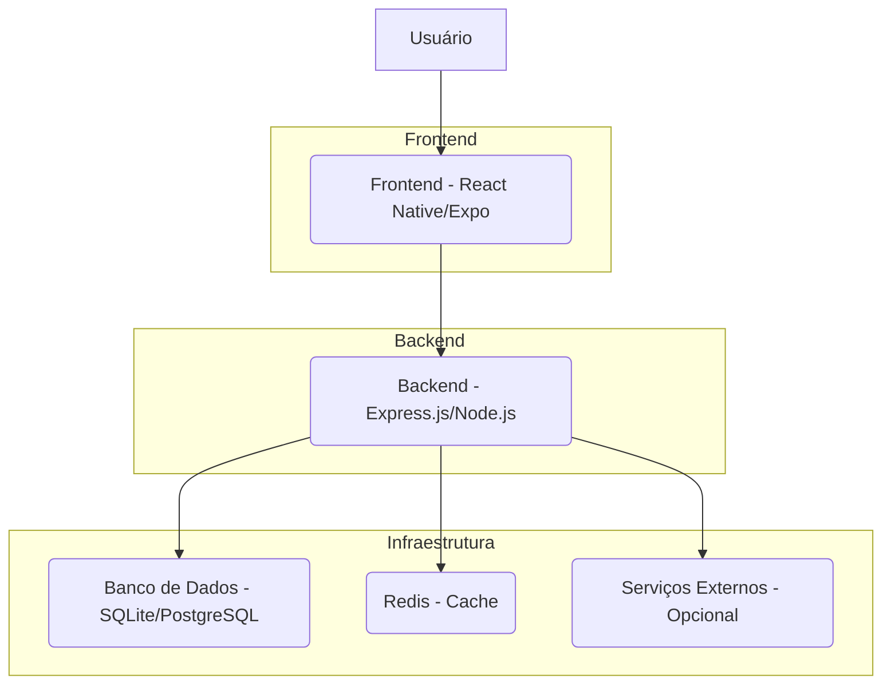
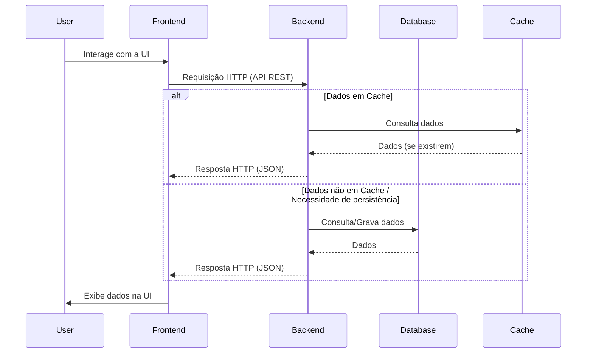

# Arquitetura Geral do Sistema GiroPro

Este documento descreve a arquitetura de alto nível do projeto GiroPro, seus principais componentes e como eles interagem. O objetivo é fornecer uma visão clara da estrutura do sistema, facilitando o entendimento e a colaboração entre os desenvolvedores.

Para uma visão das decisões arquiteturais chave e suas justificativas, consulte o [Diagrama de Decisões Arquiteturais](./diagrama_decisoes.png).

## 1. Visão Geral da Arquitetura

O GiroPro é uma aplicação full-stack composta por um backend robusto e um frontend móvel, projetados para funcionar de forma integrada. A arquitetura segue um modelo de microsserviços lógicos, onde as responsabilidades são bem definidas entre as camadas.

### 1.1. Componentes Principais

*   **Frontend (React Native/Expo)**: A interface do usuário que permite aos motoristas interagir com a aplicação. Desenvolvido para ser multiplataforma (iOS e Android), com foco em usabilidade e experiência do usuário.
*   **Backend (Express.js/Node.js)**: O coração da lógica de negócio do GiroPro. Responsável por processar requisições, interagir com o banco de dados, gerenciar a autenticação e autorização, e fornecer dados para o frontend via API RESTful.
*   **Banco de Dados (SQLite/PostgreSQL)**: Onde todos os dados da aplicação são persistidos. SQLite é usado para desenvolvimento local e testes, enquanto PostgreSQL é a escolha para ambientes de produção devido à sua robustez e escalabilidade.
*   **Redis (Cache)**: Utilizado para armazenar dados frequentemente acessados, como informações de dashboard e analytics, para melhorar o desempenho e reduzir a carga sobre o banco de dados.
*   **Serviços Externos (Opcional)**: Integrações futuras com serviços de terceiros, como APIs de mapas, serviços de pagamento ou plataformas de notificação.

## 2. Fluxo de Dados e Comunicação

A comunicação entre o frontend e o backend é realizada através de APIs RESTful. O frontend envia requisições HTTP para o backend, que processa a solicitação, interage com o banco de dados ou outros serviços, e retorna uma resposta JSON.

## 3. Decisões Arquiteturais Chave

*   **TypeScript em todo o Stack**: A escolha do TypeScript tanto no frontend quanto no backend garante tipagem forte, o que melhora a manutenibilidade, a detecção de erros em tempo de desenvolvimento e a colaboração entre equipes.
*   **Express.js no Backend**: Selecionado pela sua maturidade, flexibilidade e vasto ecossistema de middlewares, ideal para construir APIs robustas e escaláveis. Sua arquitetura baseada em middlewares facilita a modularização e a extensão.
*   **Drizzle ORM**: Um ORM leve e type-safe para TypeScript, que oferece uma excelente experiência de desenvolvimento para interações com o banco de dados, aproveitando ao máximo os recursos do TypeScript.
*   **React Native com Expo**: Permite o desenvolvimento ágil de aplicações móveis para iOS e Android a partir de uma única base de código, acelerando o tempo de lançamento e reduzindo a complexidade de manutenção.
*   **Padrões de Projeto**: A aplicação segue padrões de projeto bem estabelecidos (como MVC lógico no backend e componentes no frontend) para garantir a organização, a separação de responsabilidades e a facilidade de teste.
*   **Foco em Performance**: A utilização de Redis para cache e a escolha de frameworks consolidados (Express.js, React Query) demonstram um compromisso com a entrega de uma experiência de usuário confiável e responsiva.
*   **Gerenciamento de Plataformas**: Implementação de uma nova funcionalidade para que o usuário possa gerenciar suas plataformas de trabalho (Uber, 99, etc.), permitindo ativar/desativar as predefinidas e criar novas. Esta funcionalidade envolve novas tabelas no banco de dados (`plataformas`, `jornadasFaturamentoPorPlataforma`), serviços e controladores dedicados no backend, e uma interface de usuário correspondente no frontend.

Esta arquitetura foi projetada para ser modular, escalável e de fácil manutenção, permitindo que o GiroPro evolua e se adapte às futuras necessidades do negócio e demandas.

## 4. Diagrama de Decisões Arquiteturais

Este diagrama visualiza as principais decisões arquiteturais tomadas no projeto GiroPro e suas ramificações.

---

**Última atualização**: 01/10/2025
**Versão**: 1.1

